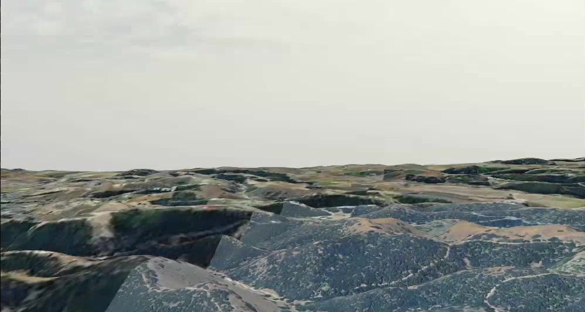

# DynamicTerrainSystem

Map imagery and elevation terrain streaming for Gazebo Harmonic, Gazebo Jetty and Gazebo Classic 11.

The plugin downloads terrain tiles around a moving aircraft and adds them to the server's sensor scene. As the aircraft moves, the terrain follows it, nearby imagery gains detail, and off-screen meshes and textures are released. Collision terrain is built separately around the vehicle.



Terrain camera view captured from a simulation on September 16, 2026.

Features:

- satellite imagery and custom tile sources
- Terrarium elevation data, with optional flat terrain
- progressive texture refinement and reusable terrain pages
- camera-based eviction of off-screen rendering resources
- bounded in-memory image and elevation caches
- local download cache for revisiting an area
- moving collision terrain and temporary startup ground

One shared terrain engine handles downloading, caching, DEM processing, meshes, collision patches and streaming. Harmonic and Jetty use one Gazebo Sim adapter with Ogre2; Classic 11 uses a separate world/visual adapter with Ogre1. One model is tracked per world. PX4 and a separate camera streaming plugin are optional.

## Supported Gazebo versions

| Target | Simulator family | Rendering | Optional GUI |
| --- | --- | --- | --- |
| `harmonic` | gz-sim8, rendering8, plugin2, SDFormat14 | Ogre2 | gz-gui8 / Qt5 |
| `jetty` | gz-sim10, rendering10, plugin4, SDFormat16 | Ogre2 | gz-gui10 / Qt6 |
| `classic` | Gazebo Classic 11 | Ogre1 | Classic visual plugin; no Qt code in this project |

Build each target separately. A library compiled for one distro must **not** be
copied into another distro. `GZ_DISTRO` defaults to `harmonic`; unknown values
and changing it in an existing build directory are rejected.

## Requirements

The core requires a C++17 compiler, CMake, Curl, OpenCV (core, imgcodecs, imgproc)
and threads. Modern adapters additionally require Protobuf and the selected
Gazebo development packages, including its Ogre2 rendering backend. Follow the
[Harmonic](https://gazebosim.org/docs/harmonic/install_ubuntu/) or
[Jetty](https://gazebosim.org/docs/jetty/install_ubuntu/) Ubuntu installation
instructions. For example, on Ubuntu 24.04 with the Gazebo repository configured:

```bash
sudo apt install build-essential cmake pkg-config libcurl4-openssl-dev \
    libopencv-dev libprotobuf-dev protobuf-compiler
# Harmonic:
sudo apt install libgz-sim8-dev libgz-plugin2-dev libgz-rendering8-ogre2-dev
# Jetty (in its own environment):
sudo apt install libgz-sim10-dev libgz-plugin4-dev libgz-rendering10-ogre2-dev
```

`BUILD_GUI=OFF` does not discover Qt or gz-gui to configure or build this project's
server plugin. Distributor development packages may still pull GUI packages via
the package manager. GUI builds require `libgz-gui8-dev`, `qtbase5-dev`,
`qtdeclarative5-dev` for Harmonic, or `libgz-gui10-dev`, `qt6-base-dev`,
`qt6-declarative-dev` for Jetty. Set `BUILD_GUI=ON` to build the existing
`libDynamicTerrainGui.so` preview plugin.

Use a separate Ubuntu 20.04 environment for Classic 11 with `gazebo11`,
`libgazebo11-dev`, Curl and OpenCV development packages. Do not install Classic
and Jetty into the same CI environment. This repository supplies a separate CI job.

An active camera sensor and the Ogre2 Sensors system are needed to render modern
server terrain. Internet access is needed for tiles not already cached.

## Build

From the repository root:

```bash
# Gazebo Harmonic
cmake -S . -B build-harmonic -DGZ_DISTRO=harmonic -DBUILD_GUI=OFF
cmake --build build-harmonic -j$(nproc)

# Gazebo Jetty
cmake -S . -B build-jetty -DGZ_DISTRO=jetty -DBUILD_GUI=OFF
cmake --build build-jetty -j$(nproc)

# Gazebo Classic 11
cmake -S . -B build-classic -DGZ_DISTRO=classic -DBUILD_GUI=OFF
cmake --build build-classic -j$(nproc)
```

Reduce the parallel job count on machines with limited RAM.

The build helper uses the same separate build directories and defaults to GUI
disabled:

```bash
./build.sh harmonic
./build.sh jetty
./build.sh classic
JOBS=2 BUILD_GUI=ON ./build.sh jetty
```

Classic always builds without the modern GUI plugin. Release maintainers can
follow [docs/releasing.md](docs/releasing.md) to tag a version and package each
backend in its matching clean environment.

Harmonic and Jetty each produce `libgz-dynamic-terrain-core.so` and
`libgz-dynamic-terrain-system.so`. The `custom::DynamicTerrainSystem` and
`custom::DynamicTerrainConfig` plugin aliases and existing model SDF syntax are
preserved. Keep both libraries together. The optional GUI library must come from
the same build.

Classic produces the shared `libgz-dynamic-terrain-core.so`, the world plugin
`libgazebo-classic-dynamic-terrain.so`, and the rendering plugin
`libgazebo-classic-dynamic-terrain-visual.so`, plus
`libdynamic-terrain-classic-adapter.so` for shared Classic transport/schema code.
Keep all four together.

Set the appropriate plugin search path in the terminal launching the simulator:

```bash
# Replace build-harmonic with build-jetty for Jetty.
export GZ_SIM_SYSTEM_PLUGIN_PATH="$PWD/build-harmonic${GZ_SIM_SYSTEM_PLUGIN_PATH:+:$GZ_SIM_SYSTEM_PLUGIN_PATH}"
# Classic:
export GAZEBO_PLUGIN_PATH="$PWD/build-classic${GAZEBO_PLUGIN_PATH:+:$GAZEBO_PLUGIN_PATH}"
```

For optional modern GUI previews also add the build directory to
`GZ_GUI_PLUGIN_PATH`. `cmake --install <build-dir> --prefix <prefix>` installs the
selected libraries and core headers. The external GT installer is unchanged.

See [docs/architecture.md](docs/architecture.md) for the backend and shared-core design.
The following server/model setup applies to Harmonic and Jetty; Classic setup is
below. Equivalent modern snippets are in
[examples/harmonic](examples/harmonic/plugin_snippet.sdf) and
[examples/jetty](examples/jetty/plugin_snippet.sdf); the original example paths
remain available.

## Server setup

For PX4, open `<PX4_PATH>/src/modules/simulation/gz_bridge/server.config`. Add the terrain system inside `<plugins>`, after the existing Ogre2 Sensors system:

```xml
<plugin entity_name="*" entity_type="world"
        filename="gz-sim-sensors-system"
        name="gz::sim::systems::Sensors">
  <render_engine>ogre2</render_engine>
</plugin>

<plugin entity_name="*" entity_type="world"
        filename="libgz-dynamic-terrain-system.so"
        name="custom::DynamicTerrainSystem"/>
```

Keep the other PX4 systems and load each system only once. The [example server configuration](examples/server.config) shows the placement; do not replace your configuration if it contains other plugins you need.

For a standalone Gazebo world, add the same two plugin entries directly inside `<world>`, without the `entity_name` and `entity_type` attributes. Keep the world's other systems, including Physics.

## World setup

Set the geographic origin inside your world's `<world>` element:

```xml
<spherical_coordinates>
  <surface_model>EARTH_WGS84</surface_model>
  <world_frame_orientation>ENU</world_frame_orientation>
  <latitude_deg>37.4319</latitude_deg>
  <longitude_deg>-122.1697</longitude_deg>
  <elevation>30</elevation>
  <heading_deg>0</heading_deg>
</spherical_coordinates>
```

Replace the latitude, longitude, and elevation with your starting location. The plugin uses Gazebo's geographic transform, including the world heading, to position terrain.

By default, `align_origin_to_ground` shifts the downloaded elevation so the ground at the origin is at local Z = 0. Set it to `false` to keep the source elevation relative to the world's elevation reference. Remove or reposition any existing ground plane that would overlap the generated terrain.

## Model setup

Copy the block from [examples/plugin_snippet.sdf](examples/plugin_snippet.sdf) into the `<model>` that terrain should follow, not into a link or camera sensor. For PX4's Cessna, this is usually `<PX4_PATH>/Tools/simulation/gz/models/rc_cessna/model.sdf`.

Set `camera_names` to the camera sensor names in your model:

```xml
<camera_names>camera_front,camera_down</camera_names>
```

Only list cameras that exist. The renderer waits until all listed cameras are available before evicting off-screen pages. Omit this setting to consider all cameras in the server scene.

The example uses a 7.5 km terrain radius and concentrates detailed imagery around the terrain patch below the aircraft. Despite its name, `bottom_camera_only` selects a ground-distance region, not the exact footprint or direction of a camera.

For video streaming, the separate [GstPlaneCameraSystem plugin](https://github.com/Xovium-Tech/px4-gazebo-gstreamer-camera-plugin) can be used with the same cameras. It is not required by the terrain plugin.

## Start the simulation

After configuring the server, world, and model, start your PX4 target:

```bash
cd /path/to/PX4-Autopilot
make px4_sitl gz_rc_cessna
```

Or start your configured standalone world:

```bash
gz sim -r /path/to/your_world.sdf
```

The first load takes longer while imagery and elevation tiles download. View the terrain through a camera sensor. With `diagnostics` enabled, messages prefixed with `[DynamicTerrain]` report downloads, terrain updates, and resource usage.

## Configuration

These settings go inside the model's `custom::DynamicTerrainConfig` block. Values below are defaults; the example adjusts a few of them for aircraft use.

| Parameter | Default | Purpose |
| --- | --- | --- |
| `visual_radius_m` | `7500` | Radius of the visual terrain area, in metres. |
| `visual_geometry_zoom` | `14` | Tile zoom used to divide the terrain mesh into pages. |
| `visual_elevation_zoom` | `13` | Elevation source zoom for the visual mesh. |
| `visual_mesh_cells_per_tile` | `64` | Mesh subdivisions per tile edge. |
| `visual_page_texture_max_size` | `2048` | Maximum texture edge length, in pixels. |
| `visual_page_cache_mb` | `128` | Refined-image cache budget in RAM, in MiB. |
| `decoded_dem_cache_mb` | `256` | Decoded elevation cache budget in RAM, in MiB. |
| `visual_frustum_eviction` | `true` | Release rendering resources for off-screen pages. |
| `visual_offscreen_frames` | `30` | Off-screen grace period, in render frames. |
| `download_concurrency` | `4` | Maximum concurrent tile downloads. |
| `download_per_host` | `1` | Maximum concurrent downloads to one host. |
| `enable_collision` | `true` | Generate the moving collision heightmap. |
| `align_origin_to_ground` | `true` | Align terrain at the origin to local Z = 0. |
| `cache_dir` | `~/.cache/gz_dynamic_terrain` | Location of cached downloads and generated terrain files. |

For lower VRAM use, start by reducing `visual_page_texture_max_size` to `1024` or reducing the visual radius. Lowering texture resolution also limits the imagery detail available on each page. A shorter off-screen grace period frees resources sooner but may cause more uploads when the camera turns.

The two RAM cache budgets are not a limit on total Gazebo memory. Active terrain, pending updates, cameras, physics, and the renderer need additional memory. The disk cache is separate and has no automatic size limit.

Collision resolution changes with the model's local Z coordinate when `dynamic_zoom` is enabled; it is not based on height above the terrain. For fixed resolution, set `dynamic_zoom` to `false` and choose `static_zoom`.

## Imagery and elevation providers

Imagery supplies the ground texture; elevation supplies its shape. They are configured independently, so you can combine, for example, Mapbox satellite imagery with Terrarium elevation.

Put the settings below inside the aircraft's `custom::DynamicTerrainConfig` plugin block, directly under `<model>`. Replace existing provider settings rather than adding duplicate tags. These are model settings, not entries for the world-level `server.config` plugin.

### Built-in imagery

| `imagery_provider` | Ground texture |
| --- | --- |
| `google_satellite` | Satellite imagery; the default. |
| `google_street` | Road map. |
| `google_terrain` | Terrain-style map, not elevation data. |
| `google_hybrid` | Satellite imagery with roads and labels. |
| `google_labels` | Labels only; not a complete background map. |
| `bing_road` | Road map. |
| `bing_satellite` | Satellite imagery. |
| `bing_hybrid` | Satellite imagery with roads and labels. |

For example, to use Bing satellite imagery with the default elevation source:

```xml
<imagery_provider>bing_satellite</imagery_provider>
<elevation_provider>terrarium</elevation_provider>
<elevation_max_zoom>15</elevation_max_zoom>
```

These names select URL templates included in the plugin; they do not guarantee service availability or permission to download tiles. The plugin does not composite separate imagery layers, so use `google_hybrid` instead of `google_labels` if you want labels over satellite imagery.

An unknown imagery name without an `imagery_url` falls back to Google satellite. In particular, setting `imagery_provider` to `mapbox` or `custom` alone does not configure another service.

### Elevation sources

| `elevation_provider` | Behaviour |
| --- | --- |
| `terrarium` | Decode Terrarium RGB tiles. Defaults to the public `elevation-tiles-prod` S3 endpoint, with no token in the URL. |
| `mapbox` | Decode Mapbox Terrain-RGB heights. Use the explicit URL in the Mapbox example below. |
| `flat` or `none` | Skip elevation downloads and use a flat surface at the world's elevation reference, before `z_offset_m`. Imagery still downloads. |

`elevation_max_zoom` limits source elevation requests and defaults to `15`. `visual_elevation_zoom` selects the source detail for the visual mesh and defaults to `13`. Raising imagery zoom does not add elevation detail.

The elevation provider also selects the pixel decoder. Use `terrarium` for Terrarium-encoded data and `mapbox` for Terrain-RGB, even when hosting those tiles yourself. A generic `custom` elevation name is not format detection: all non-flat providers other than `terrarium` currently use the Terrain-RGB decoder.

### Mapbox satellite imagery and elevation

Create an access token in your Mapbox account with access to the requested tilesets. Replace both `YOUR_MAPBOX_ACCESS_TOKEN` values below; the imagery and elevation token settings are separate, even when they contain the same token.

This is a complete model-side configuration block:

```xml
<plugin filename="libgz-dynamic-terrain-system.so"
        name="custom::DynamicTerrainConfig">
  <imagery_provider>mapbox_satellite</imagery_provider>
  <imagery_url>https://api.mapbox.com/v4/mapbox.satellite/{z}/{x}/{y}.jpg90?access_token={token}</imagery_url>
  <imagery_extension>jpg</imagery_extension>
  <imagery_token>YOUR_MAPBOX_ACCESS_TOKEN</imagery_token>

  <elevation_provider>mapbox</elevation_provider>
  <elevation_url>https://api.mapbox.com/v4/mapbox.terrain-rgb/{z}/{x}/{y}.pngraw?access_token={token}</elevation_url>
  <elevation_token>YOUR_MAPBOX_ACCESS_TOKEN</elevation_token>
  <elevation_max_zoom>15</elevation_max_zoom>
  <visual_elevation_zoom>13</visual_elevation_zoom>

  <cache_dir>~/.cache/gz_dynamic_terrain_mapbox_rgb</cache_dir>
  <diagnostics>true</diagnostics>
</plugin>
```

Here, `mapbox_satellite` is a custom cache name, not a built-in preset; `imagery_url` selects the actual service. The imagery URL uses Mapbox's [Raster Tiles API](https://docs.mapbox.com/api/maps/raster-tiles/). The elevation URL uses its documented [Terrain-RGB endpoint](https://docs.mapbox.com/data/tilesets/guides/access-elevation-data/); keep `.pngraw` so elevation values are preserved.

Do not omit `elevation_url` in this example. The plugin's current Mapbox fallback points at Terrain-DEM, which Mapbox documents as [available only through its SDKs, not the Raster Tiles API](https://docs.mapbox.com/data/tilesets/reference/mapbox-terrain-dem-v1/). Gazebo is not a Mapbox SDK client.

The current cache stores non-Terrarium elevation tiles with a `.webp` filename even when the response contains PNG data. OpenCV reads the image content; the cache suffix does not change the elevation encoding.

For Mapbox imagery with Terrarium elevation instead, keep the imagery settings, replace the elevation settings with `<elevation_provider>terrarium</elevation_provider>`, and remove `elevation_url` and `elevation_token`.

### Custom and local tile servers

Use an HTTP(S) URL that returns raster tiles on the Web Mercator XYZ grid. A URL override takes precedence over a built-in provider's URL. For example:

```xml
<imagery_provider>local_orthophoto</imagery_provider>
<imagery_url>http://127.0.0.1:8080/imagery/{z}/{x}/{y}.jpg</imagery_url>
<imagery_extension>jpg</imagery_extension>

<elevation_provider>terrarium</elevation_provider>
<elevation_url>http://127.0.0.1:8080/elevation/{z}/{x}/{y}.png</elevation_url>
<elevation_max_zoom>14</elevation_max_zoom>
<cache_dir>~/.cache/gz_dynamic_terrain_local</cache_dir>
```

The server must actually provide those paths. For locally hosted Terrain-RGB elevation, change `elevation_provider` to `mapbox` and keep an explicit URL. Elevation tiles must preserve the encoded RGB values; do not JPEG-compress them or substitute a coloured hillshade.

Use ordinary 256 × 256 imagery tiles as a starting point. Vector tiles (`.pbf`), TileJSON, `mapbox://` identifiers, and raw GeoTIFF or MBTiles datasets are not direct inputs. Serve or convert them to compatible raster tiles first. There is no automatic TMS Y-axis inversion or alpha-overlay compositing.

### URL placeholders and tokens

Both `imagery_url` and `elevation_url` support:

| Placeholder | Replacement |
| --- | --- |
| `{x}`, `{y}`, `{z}` | Tile column, row, and zoom. |
| `{q}` | Bing-style quadkey, for servers that use quadkeys instead of XYZ paths. |
| `{s}` | Numeric server shard from `0` to `3`. |
| `{s4}` | Numeric server shard from `1` to `4`. |
| `{token}` | `imagery_token` or `elevation_token`, depending on the URL. |

Only these placeholders are expanded. Tokens are substituted literally, not URL-encoded; environment variables such as `$MAPBOX_TOKEN` in SDF are not expanded by the plugin. Supplying a token does not add authentication unless the URL contains `{token}`. Custom HTTP authorization headers are not configurable.

In XML, write `&amp;` between query parameters, for example:

```xml
<imagery_url>https://your-tile-server.example/{z}/{x}/{y}.png?key={token}&amp;style=satellite</imagery_url>
<imagery_extension>png</imagery_extension>
<imagery_token>YOUR_PROVIDER_TOKEN</imagery_token>
```

### Cache and provider errors

Restart the simulation after changing provider settings. Cache entries are keyed by provider name and tile coordinates, not by the complete URL or token. When changing an endpoint or elevation dataset under the same provider name, choose a new `cache_dir` to avoid reusing old tiles.

For failed downloads, enable `diagnostics` and check the provider response. Mapbox documents `401` for missing or invalid tokens, `403` for access issues (including some URL-restricted tokens), `404` for missing tiles or tilesets, and `429` for rate limiting. See its [API error reference](https://docs.mapbox.com/api/maps/raster-tiles/). If requests are throttled, reduce `download_concurrency` and `download_per_host`.

Mapbox Terrain-RGB can return a non-image response for [tiles entirely over ocean](https://docs.mapbox.com/data/tilesets/guides/access-elevation-data/). This plugin does not translate that response into sea-level terrain, so those tiles can fail to load.

Keep tokens out of published SDF files and shared logs. Check your provider's access, caching, attribution, and usage requirements before downloading an area. The project's BSD license covers the plugin, not third-party map data.

## Classic setup

Load the world plugin under `<world>`, with `<tracked_model>` naming the model to
follow. Put the same terrain configuration element names used above directly
inside this world plugin. The complete
[Classic example](examples/classic/plugin_snippet.world) includes a geographic
origin and camera model:

```xml
<plugin name="dynamic_terrain" filename="libgazebo-classic-dynamic-terrain.so">
  <tracked_model>vehicle</tracked_model>
  <imagery_provider>google_satellite</imagery_provider>
  <elevation_provider>terrarium</elevation_provider>
</plugin>
```

The world plugin inserts a visual anchor which loads the Ogre1 visual plugin in
rendering processes. Classic transport passes the same core-generated terrain
mesh/image data to the renderer. Headless collision generation is independent
of the GUI. Run `gazebo examples/classic/plugin_snippet.world`, or `gzserver`
for a server-only run, after setting `GAZEBO_PLUGIN_PATH`.

Classic uses triangle-mesh collisions generated from the same 16-bit heightmap
samples; its native image-heightmap loader does not support that precision.
`heightmap_size` controls the collision grid in both adapters. Large grids cost
more mesh memory and insertion time in Classic than the modern heightmap path.

## Tests

The core suite builds without Gazebo installed:

```bash
cmake -S . -B build-core -DBUILD_SIMULATOR=OFF -DBUILD_GUI=OFF -DBUILD_TESTING=ON
cmake --build build-core -j$(nproc)
ctest --test-dir build-core --output-on-failure
```

It covers tile conversion and bounds, URL/cache paths, elevation decoding,
mesh indexing and normals, collision patch geometry, LOD/page order, cache
limits, headless worker operation and immutable snapshot handoff. A boundary
check rejects simulator headers/types in the core.

Each simulator build also supports `ctest --test-dir <build-dir> --output-on-failure`.
With Ubuntu 20.04's older CTest, use `(cd build-classic && ctest --output-on-failure)`.
Modern tests include geographic round trips, plugin alias loading, SDF
configuration, collision insertion and startup-ground retirement, and preview
transport. Set `BUILD_RENDER_TESTS=ON` to run the preserved Ogre2 texture/mesh
lifecycle, camera eviction and image-continuity tests; GUI builds additionally
exercise preview plugin loading and teardown. These require a working rendering
context (CI uses Xvfb/software OpenGL).

See [validation results and limits](docs/validation.md) for checks actually run
for this release. Compilation, component smoke tests and short rendering tests
do not establish compatibility with every world or long-running flight.

## Troubleshooting

- **Plugin not found:** check that `GZ_SIM_SYSTEM_PLUGIN_PATH` points to the build directory in the terminal that launches Gazebo or PX4. Keep both terrain libraries together.
- **No terrain:** check the world coordinates, the model configuration block, the Ogre2 Sensors system, and that a camera is active. Look for tile download errors in the server output.
- **Terrain missing at altitude:** check the camera's far clipping distance as well as the visual radius. Increasing either can increase rendering work.
- **Off-screen memory does not drop:** check camera names first. Cache reuse and allocator behaviour can keep process RSS above the amount of live terrain data, so inspect resource diagnostics as well as system memory.

## Repository files

[.gitignore](.gitignore) excludes build directories, CMake output, compiled libraries, test logs, editor files, and Python bytecode. It also excludes a repository-local `.cache/` directory; the default terrain cache lives outside the repository. Source files, examples, test fixtures, documentation images, and [LICENSE](LICENSE) remain trackable. Ignore rules do not remove files that Git already tracks, and they are not a substitute for checking files for credentials before publishing.

## License

BSD 3-Clause. Copyright (c) 2026 Alex Chazov. See [LICENSE](LICENSE).
